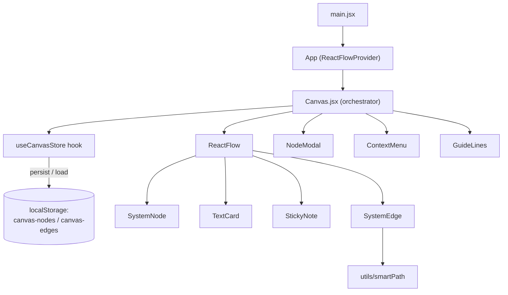

# canva

**An infinite canvas for sketching software system architecture.** Drop typed system nodes (APIs, databases, queues, services), wire them together with labeled connections that route around obstacles, and annotate the board with formatted cards and sticky notes. Built with React 19 and React Flow; everything persists to the browser, no backend required.


## Why

When you are reasoning about how the services in a system talk to each other, a general-purpose diagram tool makes you style every box by hand. This editor is opinionated instead: every node is a *system* that has a category and a health status, every connection can carry a protocol label, and the whole board saves itself locally so a sketch survives a reload. Open a tab and draw — there is no account and no server.

## Features

- **Infinite pan/zoom canvas** with a dot grid, minimap, and zoom controls (zoom range 0.01–20×).
- **System nodes in five categories** — API, Database, Queue, Service, Other — each with its own icon and accent color, and three status states: Active, Inactive, Unknown.
- **Create / edit / delete systems** through a modal form.
- **Typed connections** drawn by dragging from node handles; each edge carries an inline-editable label (for example HTTP or gRPC).
- **Obstacle-avoiding edge routing** — a forward-going connection detours around any *other* system node whose padded bounding box sits on the straight line between its endpoints, and falls back to a plain bezier when the path is clear.
- **One-click connected node** — hovering a system reveals a `+` button that opens the modal and automatically wires the new node to the source.
- **Formatted text cards** with in-place editing and a floating toolbar: five font sizes, eight text colors, eight background colors, resizable.
- **Collapsible sticky notes.**
- **Snap-to-grid** — dragging and node positions snap to a 16 px grid (the same spacing as the dot background). On resize, text cards snap width and height to 16 px, while system nodes anchor width and height to 32 px increments (position still 16 px) and keep a locked aspect ratio.
- **Alignment guides** — dragging a node shows guide lines when its edges or center line up with another node.
- **Adjacency merging** — when cards and nodes touch, their shared borders and corners merge into one seamless block; a dragged text card snaps flush to the nearest node edge and adopts that node's color.
- **Copy / paste** (`Ctrl`/`Cmd`+`C` / `V`) with a cascading offset, and **undo / redo** (`Ctrl`/`Cmd`+`Z`, and `Ctrl`/`Cmd`+`Y` or `Shift`+`Z`) backed by an in-memory history stack.
- **Right-click context menus** on the canvas (add system / card / note) and on nodes (edit / delete).
- **Automatic persistence** to `localStorage`, with migration of older edge records on load.

> The in-app UI labels are in Portuguese; the code, structure, and this document are in English.

## Tech stack

| Concern | Choice |
|---|---|
| UI | React 19.2 |
| Canvas / graph engine | @xyflow/react (React Flow) 12.10 |
| Icons | lucide-react 0.576 |
| Styling | Tailwind CSS 4.2 (via `@tailwindcss/vite`) |
| Build / dev server | Vite 7.3 |
| Linting | ESLint 9.39 (flat config) + `react-hooks` / `react-refresh` plugins |
| Language | JavaScript / JSX (no TypeScript) |

Application state lives in a single custom hook, `useCanvasStore`, built on React `useState`/`useRef` — there is no external state-management library.

## Architecture

`main.jsx` mounts `App`, which wraps everything in React Flow's provider and renders `Canvas`. `Canvas` is the orchestrator: it pulls state and actions from `useCanvasStore`, injects per-node callbacks with `useMemo`, and renders React Flow with the custom node and edge types plus the overlays (alignment guides, modal, context menu).



**Data flow:** a user action calls a handler in `useCanvasStore`, which first pushes a snapshot onto the undo stack and then mutates the `nodes`/`edges` arrays. React Flow re-renders from those arrays, and effects persist the new state to `localStorage`. Registered node types are `systemNode`, `stickyNote`, and `textCard`; the single custom edge type is `system`.

## Getting started

**Prerequisites:** Node.js 20.19+ or 22.12+ (Vite 7 dropped support for Node 18) and npm.

```bash
npm install      # install dependencies
npm run dev      # start the Vite dev server (default http://localhost:5173)
npm run build    # production build into dist/
npm run preview  # serve the production build locally
npm run lint     # run ESLint
```

There is no test suite.

## Project structure

```
canva/
├── index.html                # Vite entry
├── vite.config.js            # React + Tailwind plugins
├── eslint.config.js          # flat ESLint config
├── public/
│   └── vite.svg
└── src/
    ├── main.jsx              # React root
    ├── App.jsx               # ReactFlowProvider wrapper
    ├── index.css             # Tailwind + React Flow base styles
    ├── store/
    │   └── useCanvasStore.js # central state: nodes, edges, history, persistence, CRUD
    ├── components/
    │   ├── Canvas.jsx        # orchestrator: ReactFlow config, drag / guide / snap logic
    │   ├── SystemNode.jsx    # system box (category, status, resize, quick-connect)
    │   ├── SystemEdge.jsx    # custom edge with smart routing + editable label
    │   ├── TextCard.jsx      # formatted, resizable text card
    │   ├── StickyNote.jsx    # collapsible note
    │   ├── GuideLines.jsx    # alignment-guide overlay
    │   ├── NodeModal.jsx     # add / edit system form
    │   └── ContextMenu.jsx   # right-click menus
    └── utils/
        └── smartPath.js      # geometric edge routing (line / rectangle intersection)
```

## Status & limitations

- Personal work-in-progress project. The git history reflects active iteration, and some resize + snap-to-grid edge cases are still being smoothed out.
- Persistence is `localStorage` only — a board lives in one browser on one machine. There are no accounts, no sharing or server sync, and no export to image or JSON yet.
- No automated tests and no CI.
- Built for a mouse (pan on middle-drag, right-click menus); touch and mobile input are not handled.
- In-app copy is in Portuguese.

## License

MIT — see [`LICENSE`](LICENSE).
